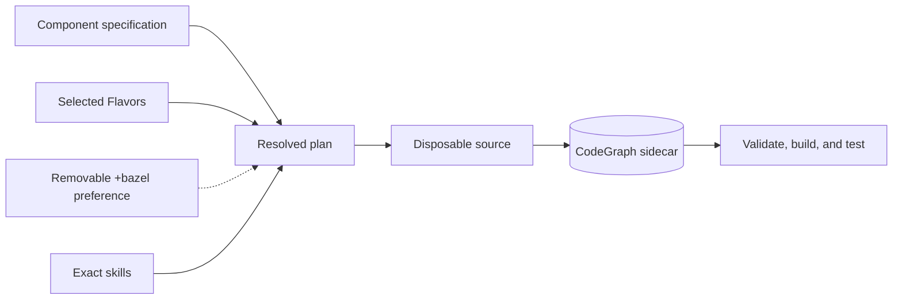

# Project guide

This documentation is the narrative spine around the project's exact artifacts. Start
with [getting started](user/getting-started.md), continue through the
[framework flow](user/framework-flow.md), then use the
[project map](user/project-layout.md) to find the authority for a change.

See [readable specifications](user/specifications.md),
[models and generation](user/models-and-generation.md),
[private test matrices](user/test-matrix.md), [active work](roadmap/active-work.md),
[security](user/security.md), [skill boundaries](architecture/skills.md), and the
[authority learning loop](architecture/authority-learning-loop.md), the
[mission-specification map](architecture/mission-specification-composition.md), and the
[traceability rule](architecture/design-traceability.md) when those concerns apply.

<!-- literate-ai: project-specific documentation (added by litai init --convert) -->
## Project notes

- [Gui](gui.md)
- [Pthread Attr Coverage](pthread-attr-coverage.md)
- [Pthread Module Inventory](pthread-module-inventory.md)
- [Pthread Non Goals](pthread-non-goals.md)
- [Qemu Hvf Isv Bug Report](qemu-hvf-isv-bug-report.md)
