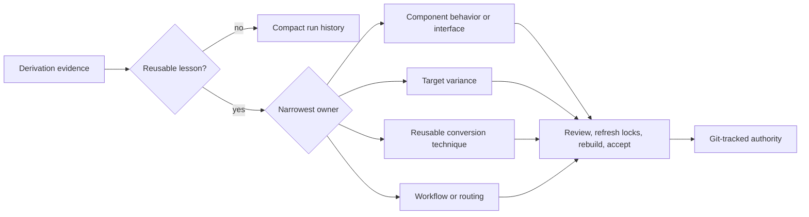

# Authority learning loop

[Project guide](../README.md) → authority learning loop

A project learns only when typed run evidence produces a reviewed Git-tracked change to
future generation authority. Retry feedback repairs one candidate; it is not durable
learning by itself.

Never copy a generated workaround into a behavioral specification merely because that
is where the failure appeared. Private acceptance values, secrets, host paths, and prior
candidate source cannot enter a learning proposal. Skill changes must also pass the
project's pinned SkillEvaluator gate. Until `litai learn` is implemented, make this
classification explicitly during review and bind the accepted lesson through the normal
authority diff, lock refresh, lifecycle, and Git commit.
