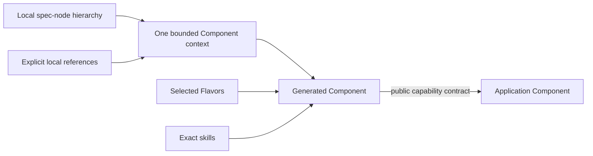

# Mission specification composition

[Project guide](../README.md) → mission specification composition

Large products use three different relations:

A local Markdown hierarchy supplies reading context. A Component capability edge joins
independently generated, cached, built, tested, versioned, and published units. Shared
OS, language, frontend strategy, packaging, and build-system choices are Flavors;
conversion conventions are skills. Do not turn either into duplicated “constraint
specs.” Only a direct dependency's public interface crosses a consumer's generation
boundary.

An agent may generate glue needed to implement selected interfaces, but observable new
behavior requires a reviewed spec change. Structural ambiguity and reference cycles
fail deterministically; natural-language contradiction is surfaced by the pinned
planning skill and resolved through human review rather than hidden by “nearest wins.”
