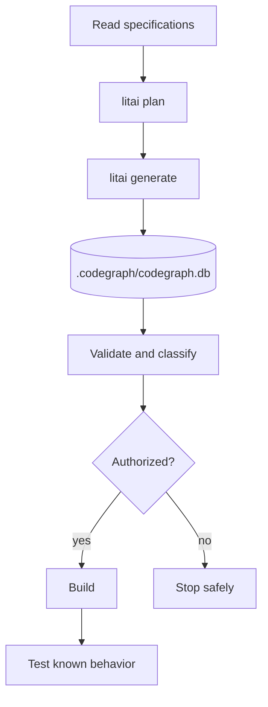

# Framework flow

[Project guide](../README.md) → framework flow

Specifications define behavior; selected Flavors add target requirements; exact skills
guide conversion; workflows and routing constrain model work. Generated source is
disposable and lives outside the project. The scaffold's `+bazel` selection is only a
removable prompt preference: explicit specification requirements and selected Flavors
take precedence, and `-bazel` removes it before prompt assembly.

Use the [project map](project-layout.md) to change the owning artifact, and read
[security](security.md) before compiling or running generated code.
