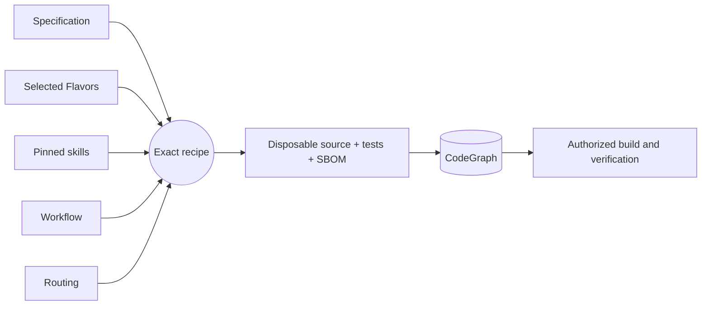

# Getting started

[Project guide](../README.md) → getting started

Literate AI keeps specifications as durable authority and generates source, current
tests, and a CycloneDX source SBOM into a disposable external workspace. Start by
validating the project and inspecting the exact recipe; planning does not invoke a
model or execute generated code.

```console
litai project validate
litai lock --check
litai plan components/hello
```

Every non-empty initialized project begins with that portable hello Component. With an
authenticated coding CLI and the selected host toolchain, prove the complete local
lifecycle before changing it:

```console
litai rebuild components/hello --project . \
  --allow-host-execution --update-receipt
```

The rebuild generates source and current tests from the specification, builds a
runnable artifact, runs both generated and independent acceptance tests, executes the
application, and commits the compact current passing receipt. Modify
`components/hello/component.md` to begin the first application, or use
`litai init --empty` when no starter is wanted.

Invoke the `Execute:` command printed by rebuild with `{"name":"LitAI"}` as its one
argument. The known output is exactly
`{"greeting":"Hello, LitAI!","name":"LitAI"}`.



`+flavor` selects a variation and `-flavor` removes one. Explicit Component and
Flavor requirements outrank defaults, so `-bazel` removes the scaffold's Bazel
preference before prompt assembly. Read the [framework flow](framework-flow.md) before
adding a lifecycle driver that compiles or runs generated source, and use the
[project map](project-layout.md) to change the owning artifact.
